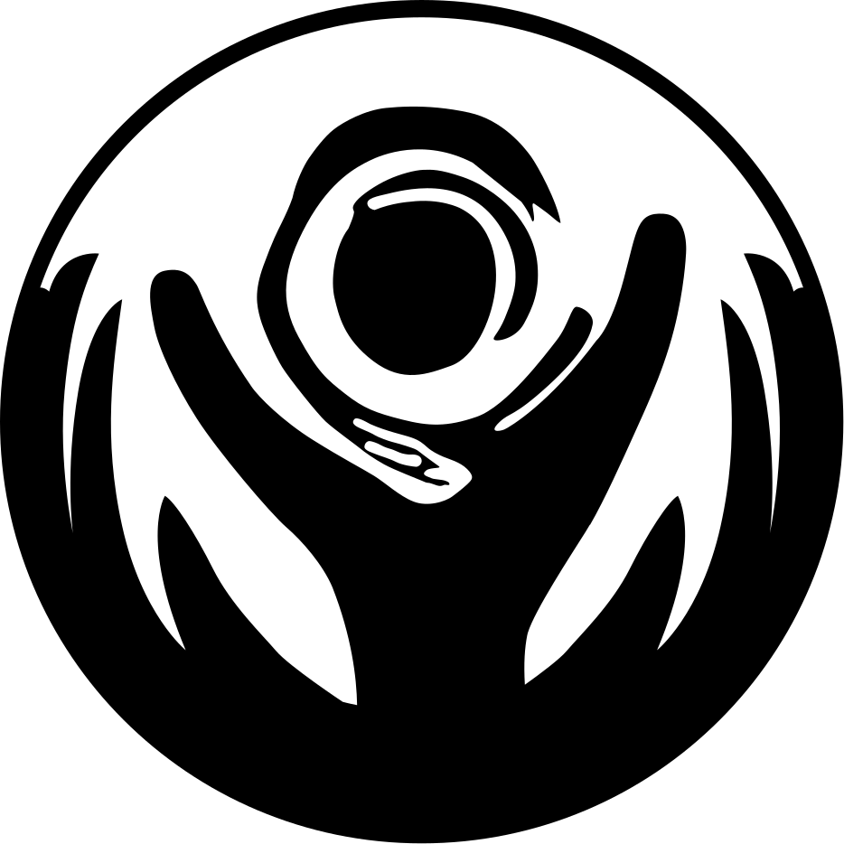

# :simple-excalidraw: Branding

Just like any other company, FundedYouth has its own color scheme for its logo and brands. The only difference is we aren't that stingy with the colors. All we ask is that if you plan to use it, you reach and ask or atleast give a link back to us.

#### Colors

| Color                                                 | Name   | Hex     | RGB               | CMYK                  | HSL               |
| ----------------------------------------------------- | ------ | ------- | ----------------- | --------------------- | ----------------- |
| :material-circle: | Blue 1 | #429DD6 | rgb(66, 157, 214) | CMYK (68, 25, 0, 0)   | HSL (203, 64, 55) |
| :material-circle: | Blue 2 | #114C78 | rgb(17, 76, 120)  | CMYK (97, 73, 29, 13) | HSL (206, 75, 27) |
| :material-circle: | Blue 3 | #2F789F | rgb(47, 120, 159) | CMYK (82, 46, 22, 2)  | HSL (201, 54, 40) |
| :material-circle: | Green  | #87A351 | rgb(135, 163, 81) | CMYK (51, 21, 87, 3)  | HSL (80, 34, 48)  |
| :material-circle: | Yellow | #F8B03A | rgb(248, 176, 58) | CMYK (1, 35, 89, 0)   | HSL (37, 93, 60)  |
| :material-circle: | Orange | #F68712 | rgb(246, 135, 18) | CMYK (0, 58, 100, 0)  | HSL (31, 93, 52)  |

#### Logo Variations

##### Original

| Image                                                                    | Description         |
| ------------------------------------------------------------------------ | ------------------- |
|  | The original design |

##### Horizontal

| Image                                                                            | Description                                                                                                                                                |
| -------------------------------------------------------------------------------- | ---------------------------------------------------------------------------------------------------------------------------------------------------------- |
|  | Original logo with the text block to the right. We ask that if you are using the horizontal design, please keep the text to the right of the logo. Thanks! |

##### Variations

Take a look at our no-text and silhouette versions.

| Image                                                                                                                     | Description                           |
| ------------------------------------------------------------------------------------------------------------------------- | ------------------------------------- |
|                                                                     | Original logo without text full color |
|                                         | Silhouette Black solid color          |
|  | Silhouette White solid color          |
