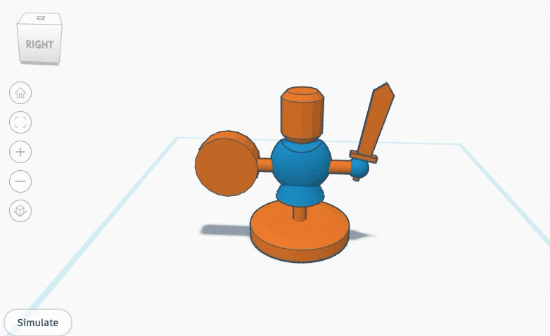

# Dummy Remix Challenge

??? info "About Remix Challenges"
    Welcome the Remix Challenges. We find an existing 3D file and generate a walkthough tutorial so you can recreate it yourself. All of our remixes are designed to be printed. We'll provide video and proof of the printed version.

## Original

??? quote "Original Creator Info"
    { width="300" }

    - **Name:** Target Dummy2
    - **Creator:** InfityModels
    - **Date:** March 11, 2022
    - **URL:** https://www.thingiverse.com/thing:5294269


## **Tutorial**

For this tutorial we will be making a Target Dummy using the TinkerCAD tool. We will print this a Sovol SV06 Plus 3D Printer.




1. To begin, open a browser and go to TinkerCAD.com
2. Login and create a new project. Name it: **Target Dummy**

3. The first piece we will create is the center post. Drag and drop a cylinder onto the stage. Set it's dimensions to:

```py
width   [x]: 5 mm
length  [y]: 5 mm
height  [z]: 50 mm
```


